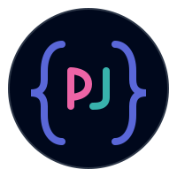

# PrettyJson



### A modern, beautiful JSON formatting tool built with Next.js and Material UI.

## 🌟 Features

- **Tree View & Syntax Highlighting** - Interactive navigation with color-coded elements
- **Validation** - Real-time error detection with position indicators
- **Dark/Light Mode** - Theme switching for comfortable viewing
- **Import/Export** - File upload, download, and clipboard integration
- **Responsive Design** - Optimized for all device sizes

## 🚀 Getting Started

### Prerequisites

- Node.js 14.x or higher
- npm or yarn

### Installation

1. Clone the repository:

   ```bash
   git clone https://github.com/yourusername/PrettyJson.git
   cd prettyjson
   ```

2. Install dependencies:

   ```bash
   npm install
   # or
   yarn install
   ```

3. Run the development server:

   ```bash
   npm run dev
   # or
   yarn dev
   ```

4. Open [http://localhost:3000](http://localhost:3000) with your browser to see the application.

## 🛠️ Tech Stack

- **Framework**: [Next.js](https://nextjs.org/)
- **UI Library**: [Material UI](https://mui.com/)
- **Animations**: [Framer Motion](https://www.framer.com/motion/)

## Support Me

If you find it useful, consider giving it a star ⭐. It helps others discover it too.

## 🤝 Contributing

Contributions are welcome! Please feel free to submit a Pull Request.

1. Fork the repository
2. Create your feature branch (`git checkout -b feature/amazing-feature`)
3. Commit your changes (`git commit -m 'Add some amazing feature'`)
4. Push to the branch (`git push origin feature/amazing-feature`)
5. Open a Pull Request

## 📝 License

This project is licensed under the MIT License - see the [LICENSE](LICENSE.md) file for details.

## 🙏 Acknowledgements

- [Material UI](https://mui.com/) for the beautiful component library
- [Framer Motion](https://www.framer.com/motion/) for smooth animations
- [Next.js](https://nextjs.org/) for the React framework

---

Made with ❤️ by Debojit
